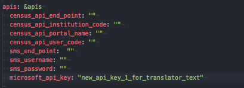
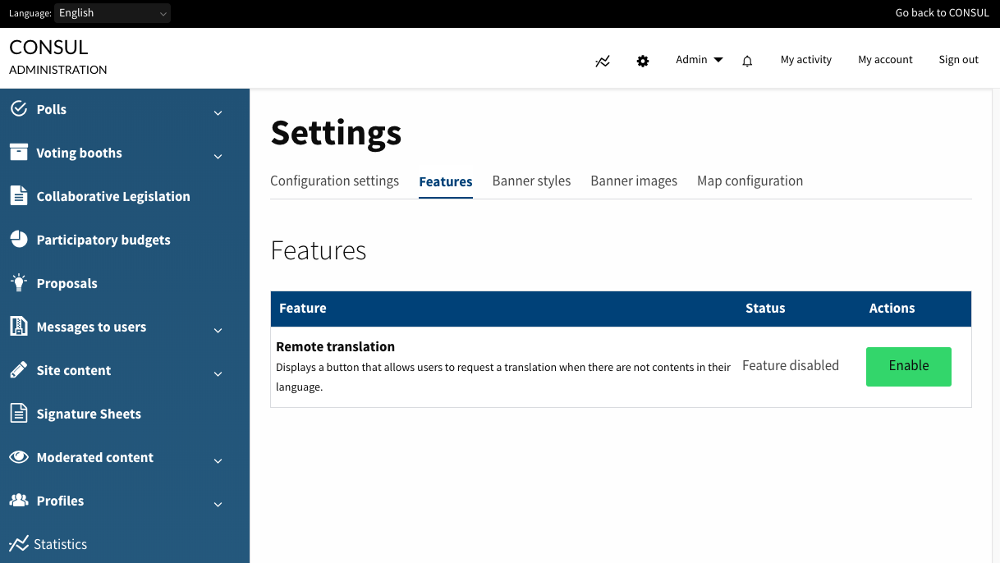
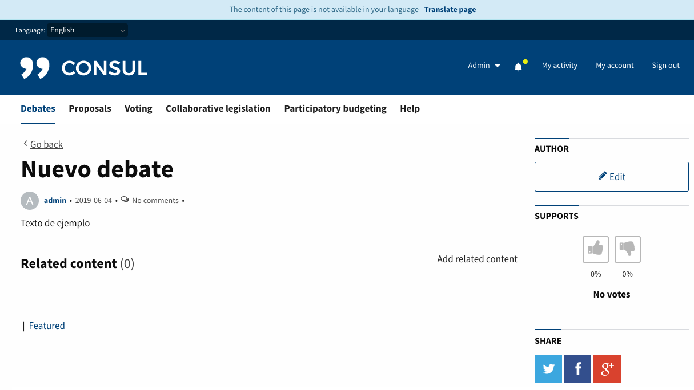
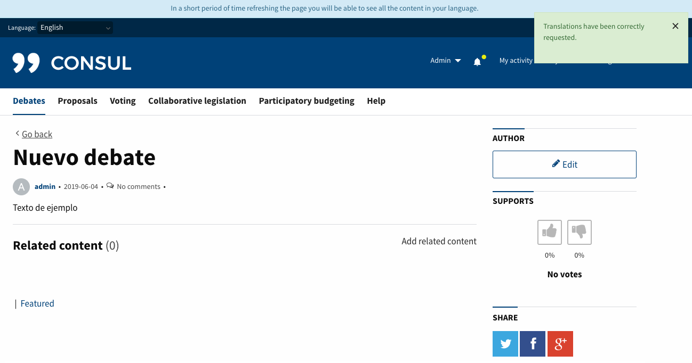
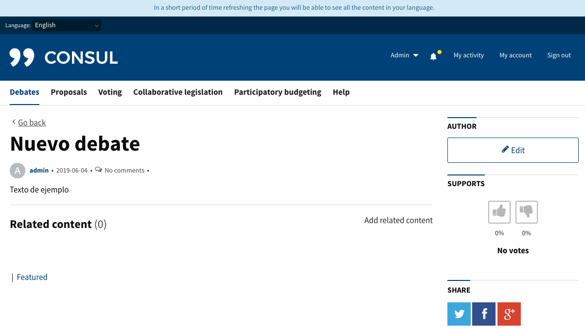
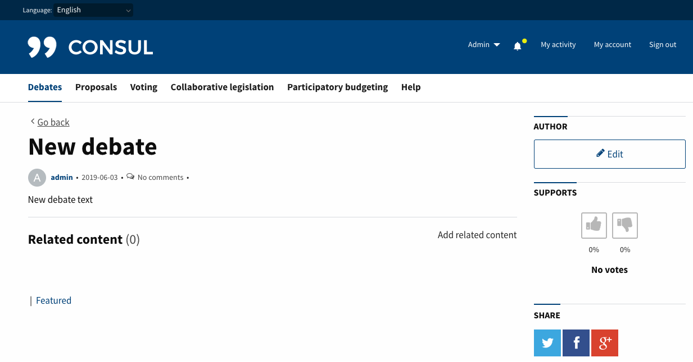
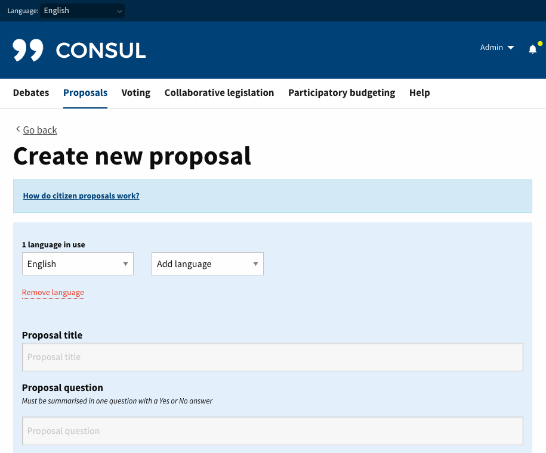
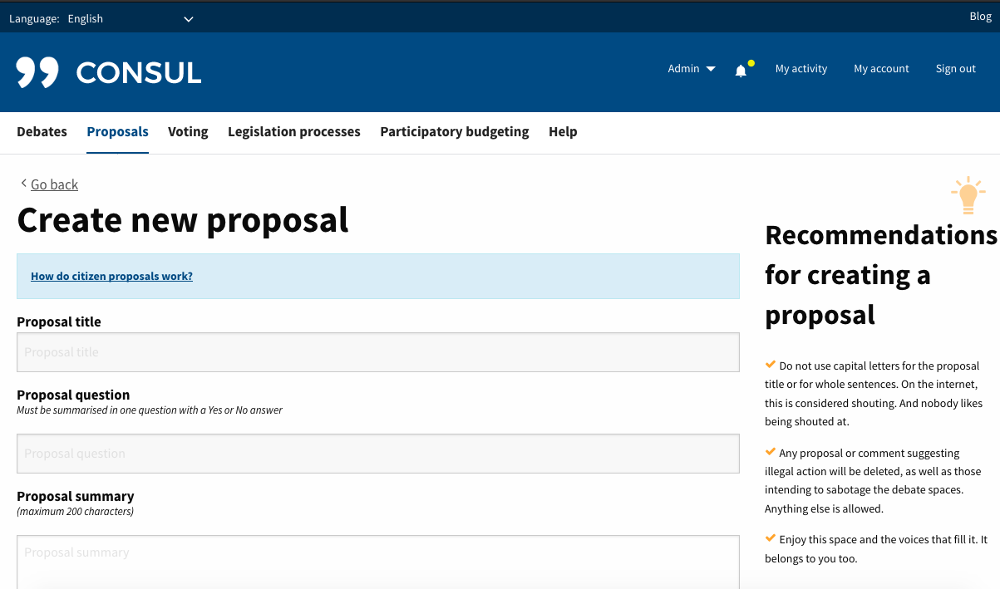

# Customization

You can modify your own CONSUL to have your custom visual style, but first you'll have to [create your own fork from](../getting_started/create.md).

We've created an specific structure where you can overwrite and customize the application in a way that will let you keep updating it from CONSUL's main repository, without having conflicts on code merging or risking loosing your customization changes. We try to make CONSUL as vanilla as possible to help other developers onboard the codebase.

## Special Folders and Files

In order to customize your CONSUL fork, you'll make use of some `custom` folders on the following paths:

* `config/locales/custom/`
* `app/assets/images/custom/`
* `app/views/custom/`
* `app/controllers/custom/`
* `app/models/custom/`

Also these are the files where you can apply some customization:

* `app/assets/stylesheets/custom.css`
* `app/assets/stylesheets/_custom_settings.css`
* `app/assets/javascripts/custom.js`
* `Gemfile_custom`
* `config/application.custom.rb`

## Remote translations on demand by the user

The aim of this service is to be able to offer all the dynamic contents of the application (proposals, debates, budget investments and comments) in different languages without the need for a user or administrator to have created each one of their translations.

When an user visit a page with a language where there is untranslated content, he will has a button to request the translation of all the content. This content will be sent to an automatic translator (in this case [Microsoft TranslatorText](https://azure.microsoft.com/en-us/services/cognitive-services/translator-text-api/)) and as soon as the response is obtained, all these translations will be available to any user.

#### Getting started
In order to use this functionality, the following steps are necessary:
1. Have an api key to connect to the translation service. For this we need an [Azure account](https://azure.microsoft.com/en-us/)
1. Once you are logged into the Azure portal, subscribe to the Translator Text API in Microsoft Cognitive Service.
1. Once you have subscribed to the Translator Text service, you will have access to 2 api keys in the section **RESOURCE MANAGEMENT > Keys** that will be necessary for the configuration of the translation service in your application.

#### Configuration
To activate the translation service in your application you must complete the following steps:

##### Add api key in the application
In the previous section we have commented that once subscribed to the translation service we have 2 api keys. To configure the service correctly in our application we must add one of the two api keys in the file `secrets.yml` in section `apis:` with the key `microsoft_api_key` as we can see in the following image:



##### Activate module
Once we have the new key in the `secrets.yml` we can now proceed to activate the module. To activate the functionality you must follow 2 steps:
1. Execute the following command `bin/rake settings:create_remote_translations_setting RAILS_ENV=production`
1. Accessing through the administration panel of your application to the section **Configuración > Funcionalidades** and activate module **Traducciones Remotas** as shown below:


#### Use Cases
Once we have the api key in our `secrets.yml` and the activated module, users will already be able to use the functionality.
We attach some screenshots of how the application interacts with our users:
* When a user visits a page in a language without translated content, an informative text will appear at the top of the page and a button to request the translation. (**Note:** *If user visit page with a language not supported by the translation service, no text or translation button will be displayed. See section: Available languages for remote translation*)


* Once the user click the `Translate page` button, the translations are enqueued and the page is reloaded with a notice (*Informing that the translations have been requested correctly*) and an informative text in the header (*explaining when you will be able to see these translations*).


* If an user visit a page that does not have translations but have already been requested by another user. The application will not show you the translate button, but an informative text in the header (*explaining when you will be able to see these translations*).


* The translation request, response processing and data saving are delegated to `Delayed Jobs` and as soon as they are processed, the user will be able to read them after page refresh.



#### Available languages for remote translation
Currently these are all the [available languages](https://docs.microsoft.com/en-us/azure/cognitive-services/translator/quickstart-ruby-languages) in the translation service:
```yml
["af", "ar", "bg", "bn", "bs", "ca", "cs", "cy", "da", "de", "el", "en", "es", "et", "fa", "fi", "fil", "fj", "fr", "he", "hi", "hr", "ht", "hu", "id", "is", "it", "ja", "ko", "lt", "lv", "mg", "ms", "mt", "mww", "nb", "nl", "otq", "pl", "pt", "ro", "ru", "sk", "sl", "sm", "sr-Cyrl", "sr-Latn", "sv", "sw", "ta", "te", "th", "tlh", "to", "tr", "ty", "uk", "ur", "vi", "yua", "yue", "zh-Hans", "zh-Hant"]
```
Of all the languages that Consul currently has defined(`available_locales`) in `config/application.rb` are not included in the above list and no translation service is offered for the following languages:
```yml
["val", "gl", "sq"]
```

#### Pricing
The translation service used has the [pricing](https://azure.microsoft.com/en-us/pricing/details/cognitive-services/translator-text-api/) the most competitive.
The price for each 1 Million characters translated is 8.43 € and there is no fixed cost per month.
Google and DeepL have an approximate price of between 16.00 € and 20.00 € for each 1 million characters and a fixed monthly cost.

Alerts can be created on several parameters, including the `Number of translated characters` within the Azure administration panel in the **Supervision** section.

#### Add a new translation service
If you want to integrate more translation services for any reason (new translation service appears, you want to change to include languages that are currently not supported, etc.) the code is ready to be added.
This is made possible by the `RemoteTranslations::Caller` class which is an intermediate layer between untranslated content management and the currently used Microsoft Translation Client.
A good solution for adding another translation service would be to replace the call to the `MicrosoftTranslateClient` in the `translations` method of `RemoteTranslations::Caller` with the new service implemented.
If you want to coexist with both should only be managed in which case we want to use one or the other, either through specific conditions in the code or through a management in the Settings of the application.

```ruby
class RemoteTranslationsCaller

  ...
  def translations
    @translations ||= RemoteTranslations::Microsoft::Client.new.call(fields_values, locale)
    # Add new RemoteTranslations Client
    # @translations = RemoteTranslations::NewTranslateClient::Client.new.call(fields_values, locale_to)
  end
  ...

end
```   

## Translation interface

The aim of this feature is to allow users the introduction of dynamic contents in many languages at the same time. From the administration panel you can activate or deactivate it. If you deactivate this feature (default configuration) users will be able to enter one single translation.

#### Enable module
To activate this feature you must follow 2 steps:
1. Execute the following command `bin/rake settings:create_translation_interface_setting RAILS_ENV=production` (This is only required for already existing intallations, for new consul installations this step is not needed).
2. Accessing as administrator user to the administration panel of your Consul application to the section **Configuration > Features** and activating the feature called **Translation Interface** as you can see next:


#### Use Cases

* When the translation interface is active:
As you can see in the image below translation interface has two selectors, the firt one "Select language" is to switch between enabled languages and the second one "Add language" is to add new languages to the form. Translatable fields appears with a blue background to facilitate users to distinguish between translatable and not translatable fields. Additionally interface provides a link `Remove language` to delete the current language shown at "Select language". If a user accidentally removes a translation he can recover it re-adding it to the form.
This feature is visible during creation and edition of translatable resources.


* When the translation interface is disabled:
When this feature is deactivated users will see standard forms without translation interface and without translation highlight.

