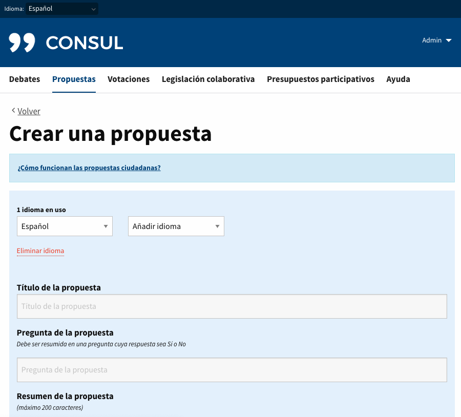
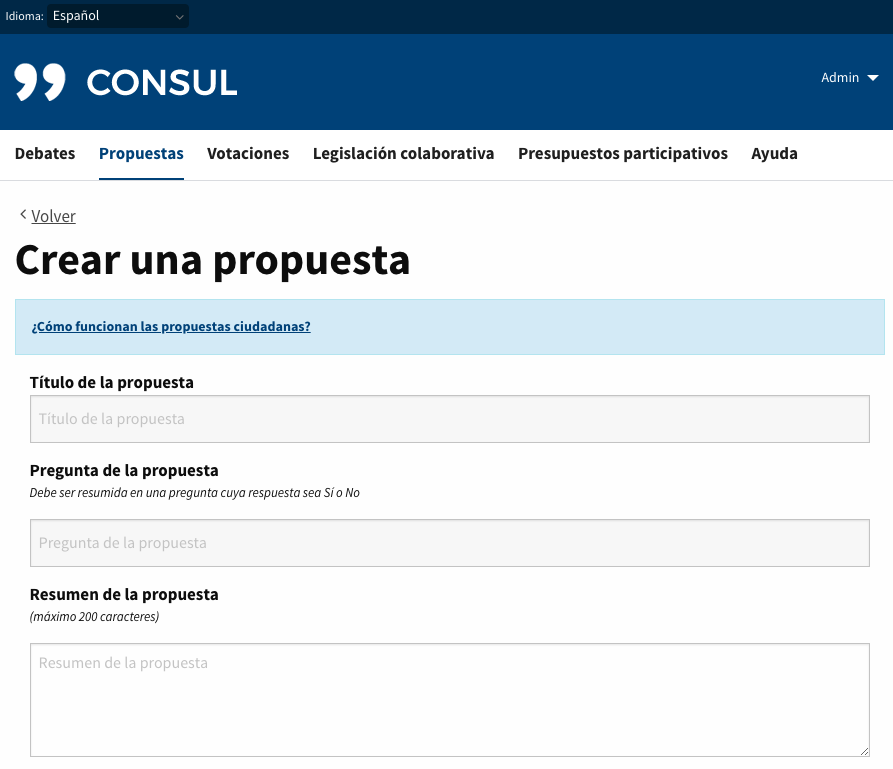

# Personalización

Puedes modificar CONSUL y ponerle tu propia imagen, para esto debes primero [crear tu propio fork](forks/create.md).

Hemos creado una estructura específica donde puedes sobreescribir y personalizar la aplicación para que puedas actualizar sin que tengas problemas al hacer merge y se sobreescriban por error tus cambios. Intentamos que CONSUL sea una aplicación Ruby on Rails lo más plain vanilla posible para facilitar el acceso de nuevas desarrolladoras.

## Ficheros y directorios especiales

Para adaptar tu fork de CONSUL puedes utilizar alguno de los directorios `custom` que están en las rutas:

* `config/locales/custom/`
* `app/assets/images/custom/`
* `app/views/custom/`
* `app/controllers/custom/`
* `app/models/custom/`

Aparte de estos directorios también cuentas con ciertos ficheros para:

* `app/assets/stylesheets/custom.css`
* `app/assets/stylesheets/_custom_settings.css`
* `app/assets/javascripts/custom.js`
* `Gemfile_custom`
* `config/application.custom.rb`

## Interfaz de traducción

Esta funcionalidad tiene como objetivo permitir introducir todos los contenidos dinámicos de la aplicación (propuestas, debates, inversiones presupuestarias y comentarios) en diferentes idiomas. Desde el panel de administración se puede activar o desactivar la interfaz de traducción.

#### Activar funcionalidad
Para activar la funcionalidad deberá realizar 2 pasos:
1. Ejecutar el siguiente comando `bin/rake settings:create_translation_interface_setting RAILS_ENV=production`
1. Acceder a través del panel de administración de su aplicación a la sección **Configuración > Funcionalidades** y activar el módulo de **Interfaz de traducción** como se puede ver a continuación:

#### Funcionalidad
Dependiendo de si activamos o desactivamos el módulo de **Interfaz de traducción** veremos los formularios accesibles por el usuario de la siguiente manera:
* Cuando la interfaz de traducción esta activa:
Como podemos ver en la imagen aparece un selector para añadir idiomas donde cada vez que seleccionamos uno aparece en el selector de idiomas en uso y se visualizan los campos traducibles con un fondo azul. También disponemos de un botón `Eliminar idioma` para eliminar un idioma en caso de necesitarlo.
Esta funcionalidad está visible tanto para las páginas de creación como para las páginas de edición.

* Cuando la interfaz de traducción esta desactivada:
Como se puede ver en la imagen al tener desactivada esta funcionalidad se mantiene la renderización actual en los formularios tanto de creación como de edición:

