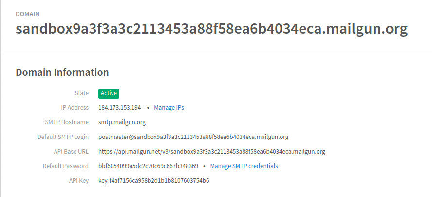

# Servidor de correo de desarrollo

Este es un ejemplo de cómo integrar un servicio de correo con un entorno de desarrollo de Consul.

En este ejemplo usamos a [Mailgun](https://www.mailgun.com/).

## Crear una cuenta en Mailgun


* Omita el formulario de tarjeta de crédito
* Y active su cuenta con el enlace enviado por correo electrónico


## Configuración del domain
* Ve a la sección domain:


* Como todavía no tienes un domain, debes hacer clic en el sandbox que ya está creado;
* Recuerde las próximas credenciales:


## Configuración de correo del Consul para el entorno de desarrollo
* Vaya al archivo `config/environments/development.rb`;
* Agregue las líneas en el archivo para configurar el servidor de correo:

``` ruby
  config.action_mailer.delivery_method = :smtp
  config.action_mailer.perform_deliveries = true
  config.action_mailer.smtp_settings = {
      :address              => '',
      :port                 => 2525,
      :domain               => '',
      :user_name            => '',
      :password             => '',
      :authentication => :plain,
      :enable_starttls_auto => true,
      :ssl => false
  }
```

* Rellene, `address`, `domain`, `user_name`, `password` con su información. El archivo se vería así:


## Configuración de correo de Consul para el entorno de producción

* Vaya al archivo `config/environments/production.rb`;
* Agregue la misma configuración de **action mailer settings**, pero ahora con su información de servidor de correo de producción.
* Preste atención porque necesitará cambiar el número del **puerto** para **587**.

Puede usar Mailgun para producción también, agregando su dominio personalizado. Mailgun hay registros (logs) de los correos enviados y entregues.