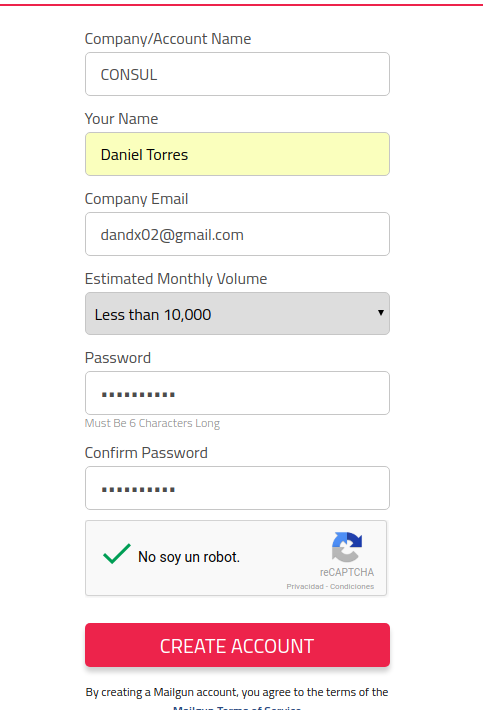

# Configuración del servidor de correo

Este es un ejemplo de cómo integrar un servicio de correo con Consul.

En este ejemplo usamos [Mailgun](https://www.mailgun.com/).

## Crear una cuenta en Mailgun



* Puedes omitir el formulario de tarjeta de crédito
* Y activa tu cuenta con el enlace enviado por correo electrónico

## Configuración del dominio

* Ve a la sección "domain": 
* Como todavía no tienes un dominio, debes pinchar en el "sandbox" que ya está creado
* Recuerda las siguientes credenciales: 

## Configuración del correo en Consul

* Ve al archivo `config/secrets.yml`
* Modifica las líneas en el archivo para configurar el servidor de correo:

```yml
  mailer_delivery_method: :smtp
  smtp_settings:
     :address: "<smtp address>"
     :port: 587
     :domain: "<domain>"
     :user_name: "<user_name>"
     :password: "<password>"
     :authentication: "plain"
     :enable_starttls_auto: true
```

* Rellena `<smtp address>`, `<domain>`, `<user_name>` y `<password>` con tu información.
* Guarda el fichero y reinicia tu aplicación Consul
